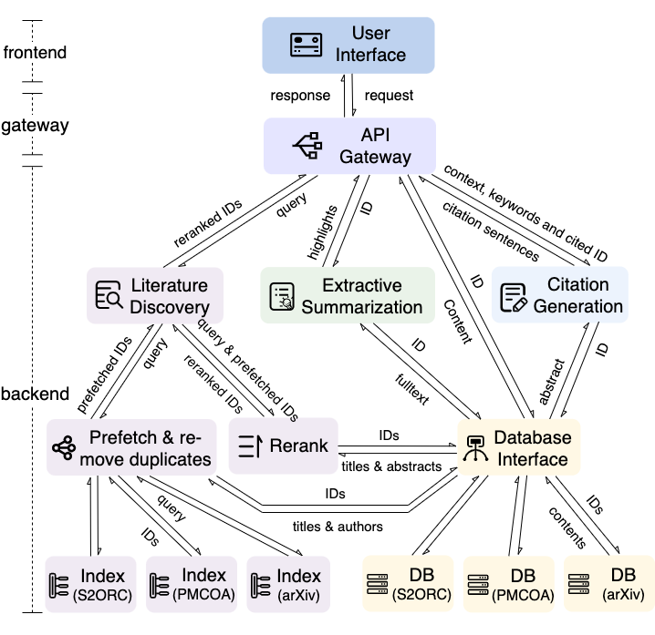

# Documentation of Microservices


```python
import requests, json
import matplotlib.pyplot as plt
import imageio
import numpy as np
from termcolor import colored
import time
```

## Define Helper Functions
* These helper functions are used only for this notebook for displaying results returned from the microservice API gateway.
* They are not necessary when using the the microservice APIs when deploying the frontend.


```python
class bcolors:
    HEADER = '\033[95m'
    OKBLUE = '\033[94m'
    OKCYAN = '\033[96m'
    OKGREEN = '\033[92m'
    WARNING = '\033[93m'
    FAIL = '\033[91m'
    ENDC = '\033[0m'
    BOLD = '\033[1m'
    UNDERLINE = '\033[4m'

def print_title(title, max_len = 110):
    title = title +" " * (max_len-len(title)) +'"Cite'
    print(bcolors.BOLD + bcolors.HEADER + title + bcolors.ENDC)

def print_year(year):
    print(bcolors.BOLD + bcolors.OKBLUE + str(year) + bcolors.ENDC)

def print_section_name( section_name ):
    print(bcolors.BOLD  + section_name + bcolors.ENDC)
    
def print_highlighted_sentence(sen, end ="\n"):
    sen = sen.replace("\n"," ").replace("\r"," ")
    print(bcolors.BOLD + bcolors.WARNING + str(sen)[:150] + bcolors.ENDC, end=end, flush =True)

def remove_none(a):
    if a is None:
        return ""
    else:
        return a

def print_authors(authors):
    author_list = []
    for author in authors:
        given_name = remove_none(author.get("GivenName", ""))
        family_name = remove_none(author.get("FamilyName", ""))
        author_list.append( given_name+" "+family_name)
    print("   ".join(author_list))
    
def print_pagination_results(pagination_results):
    for res in pagination_results:
        print_title(res.get("Title",""))
        if isinstance(res.get("PublicationDate",{}),dict):
            print_year(res.get("PublicationDate",{}).get("Year",""))
        if isinstance(res.get("Author",[]),list) and len(res.get("Author",[]))>0:
            print_authors(res.get("Author",[]))
        if isinstance(res.get("relevant_sentences",[]),list) and len(res.get("relevant_sentences",[]))>0:
            print()
            print("...".join(res.get("relevant_sentences",[])))
        if res.get("Content",{}).get("Abstract","").strip() != "":
            print( res.get("Content",{}).get("Abstract","")  )
            print("\n")
        print()
        
def print_paper( paper_info, collection):
    print_title(paper_info.get("Title",""))
    print("source: ", collection)
    if isinstance(paper_info.get("PublicationDate",{}),dict):
        print_year(paper_info.get("PublicationDate",{}).get("Year",""))
    print_authors(paper_info.get("Author",[]))
    print("\n")
    
    if "Content" in paper_info:
        for tag in ["Abstract_Parsed","Fullbody_Parsed"]:
            if tag not in paper_info["Content"]:
                continue
            for section in paper_info["Content"][tag]:
                print_section_name( section.get("section_title","") )
                print("\n")
                for para in section.get("section_text",[]):
                    for sen in para.get("paragraph_text",[]):
                        sim = sen.get("sentence_similarity",0.0)
                        text = sen.get("sentence_text","")
                        if sim >0:
                            print_highlighted_sentence(text, end = " ")
                        else:
                            print(text, end=" ", flush = True)
                print("\n")
                
def color_sen(sen):
    sen_text = sen["sentence_text"]
    cite_spans = sen["cite_spans"]
    colored_text = ""
    current_pos = 0
    for cite_span in cite_spans:
        start, end = int(cite_span["start"]), int(cite_span["end"])
        colored_text += sen_text[current_pos:start]+colored(sen_text[start:end],"blue")
        current_pos = end
    colored_text += sen_text[current_pos:]
    return colored_text

def print_para( para ):
    corlored_para = ""
    for sen in para["paragraph_text"]:
        corlored_para += color_sen(sen) + " "
    print(corlored_para)

def print_sec( sec ):
    print(bcolors.BOLD+ sec["section_title"] +bcolors.ENDC + "\n")
    for para in sec["section_text"]:
        print_para(para)
        print()
```

## Microservice-Based Architecture

[](https://aclanthology.org/2023.acl-demo.22/)

## Address of API Gateway 

As shown in the architecture, once the backend service has been started, the API gateway is used the bridge the connection between frontend and backend. Therefore, from the perspective of frontend (or API user), we only need to know the address of the API gateway.

Suppose that in the file [final_api_gateway/docker-compose.yaml](final_api_gateway/docker-compose.yaml), the port mapping rule looks like:

        ports:
            - 8060:8060    # Host PORT : container PORT
this means it maps the host machine's 8060 port to the port 8060 of API gateway's docker container. In this case, when we can to send request to the API gateway, the base address (without endpoint name) is:

        http://localhost:8060

where localhost refers to the hostmachine. We can further use [ngrok](https://ngrok.com/) to map the port 8060 to www, to make the API gateway accessible from anywhere in the world. Then the API address will be changed to 

        https://xxxxx.ngrok.io (no port number is needed)
        
In this example, we run the backend in our local machine, so we set (suppose the host port is 8060):


```python
api_gateway_address = "http://localhost:8060" 
```

## Microservice: Document search

### Service address
Service address refers to the address to the corresponding endpoint: api gateway's base address + endpoint name


```python
api_gateway_address+"/ml-api/doc-search/v1.0"
```


    'http://localhost:8060/ml-api/doc-search/v1.0'


### Description
1. **Function:** perform document search under different scenarios, including: <br>
    a) semantic search:  selected content (text or paper) as ranking source & keywords filtering <br>
    b) search from my library <br>
    c) generic search: given the title of a paper, find this paper from our database
    
2. **Input:** a request dictionary that contains the following key-value pairs: <br>
    a) "**ranking_variable**": <br> 
    &ensp;&ensp; optional, default: ""(empty string) <br>
    &ensp;&ensp; texts that users type in the "ranking source text" box, or texts that are selected from the manuscript as the query. If "ranking_variable" is provided, then the value of "ranking_variable" will be used as final ranking source.<br>
    b) "**ranking_collection**": <br>
    &ensp;&ensp; optional, default: "" <br>
    &ensp;&ensp; If users want to find relevant papers of a certain query paper, then the collection name of that query paper must be provided. <br>
    c) "**ranking_id_field**": <br>
    &ensp;&ensp; optional, default: "" <br>
    &ensp;&ensp; If users want to find relevant papers of a certain query paper, then the paper id field of that query paper must be provided. E.g. the paper id type can be "id_int", which is most commonly used. It is also possible to use the "DOI" field as paper id. <br>
    d) "**ranking_id_value**": <br>
    &ensp;&ensp; optional, default: "" <br>
    &ensp;&ensp; If users want to find relevant papers of a certain query paper, then the paper id value of that query paper must be provided.<br>
    e) "**ranking_id_type**": <br>
    &ensp;&ensp; optional, default: "", not necessary<br>
    f) "**keywords**": <br>
    &ensp;&ensp; optional, default: ""<br>
    &ensp;&ensp; This is used for keyword boolean filter. If all the keys above are not provided and only keywords provided, then use keywords alse as ranking source. When users want to perform a generic search, e.g. **search for a paper given title**, then simply use the title as "keywords". In this case, the ranking variable can either be the abstract (if available) or "" (empty string).<br>
    g) "**paper_list**": <br>
    &ensp;&ensp; optional, default: ""<br>
    &ensp;&ensp; This is used to specify a range of papers within wich users search for relevant papers. For example, if users want to search for relevant papers from "My Libraray", then set the value of "paper_list" as the list of the ids of the papers in users' libraray, with the following format:<br> [ { "collection":"PMCOA", "id_field": "id_int", "id_value": 123  }, ... ]<br>
    h) "**username**": <br>
    &ensp;&ensp; optional, default: ""<br>
    i) "**nResults**": <br> 
    &ensp;&ensp; The maximum number of returned paper ids <br>
    &ensp;&ensp; optional, default: 100<br>
    Max number of results to be returned. <br>
3. **Output:** A results dictionary with the following format: <br>
{ "query_id": "fa27a7a6-0026-45f9-9c81-e47cf4ea5c57", <br>
  "response": [ {'collection': 'pubmed', 'id_field': 'id_int', 'id_type': 'int', 'id_value': 123}, ...  ], <br>
  'search_stats': {'DurationTotalSearch': 87, 'nMatchingDocuments': 1000000}<br>
}<br>
Here "query_id" is a randomly generated unique id string that is associated with current search behavior. This can be used to achieve the click feedback function. For example, when users search for something, after they get the searched results and they click a certain paper, then the frontend can return current "query_id" and the id information of the clicked paper back to the click-feedback api (described below).


### Example


```python
ranking_variable = "recent progress in Covid-19"
keywords = "covid"
query_data ={
    "ranking_variable":ranking_variable,
    "keywords":keywords,
}
output = requests.post( api_gateway_address+"/ml-api/doc-search/v1.0", 
                                      data = json.dumps(  query_data ), 
                                      headers = {"Content-Type": "application/json"} ).json()

print(output)
```

    {'query_id': '8e0194c5-3a12-49d6-a84b-006347af0ef8', 'response': [{'collection': 'arXiv', 'id_field': 'id_int', 'id_type': 'int', 'id_value': 675}, {'collection': 'arXiv', 'id_field': 'id_int', 'id_type': 'int', 'id_value': 436}, {'collection': 'arXiv', 'id_field': 'id_int', 'id_type': 'int', 'id_value': 576}, {'collection': 'arXiv', 'id_field': 'id_int', 'id_type': 'int', 'id_value': 345}, {'collection': 'arXiv', 'id_field': 'id_int', 'id_type': 'int', 'id_value': 481}, {'collection': 'arXiv', 'id_field': 'id_int', 'id_type': 'int', 'id_value': 582}, {'collection': 'arXiv', 'id_field': 'id_int', 'id_type': 'int', 'id_value': 518}, {'collection': 'arXiv', 'id_field': 'id_int', 'id_type': 'int', 'id_value': 755}, {'collection': 'arXiv', 'id_field': 'id_int', 'id_type': 'int', 'id_value': 344}, {'collection': 'arXiv', 'id_field': 'id_int', 'id_type': 'int', 'id_value': 503}, {'collection': 'arXiv', 'id_field': 'id_int', 'id_type': 'int', 'id_value': 955}, {'collection': 'arXiv', 'id_field': 'id_int', 'id_type': 'int', 'id_value': 490}, {'collection': 'arXiv', 'id_field': 'id_int', 'id_type': 'int', 'id_value': 506}, {'collection': 'arXiv', 'id_field': 'id_int', 'id_type': 'int', 'id_value': 917}, {'collection': 'arXiv', 'id_field': 'id_int', 'id_type': 'int', 'id_value': 485}, {'collection': 'arXiv', 'id_field': 'id_int', 'id_type': 'int', 'id_value': 735}, {'collection': 'arXiv', 'id_field': 'id_int', 'id_type': 'int', 'id_value': 856}, {'collection': 'arXiv', 'id_field': 'id_int', 'id_type': 'int', 'id_value': 541}, {'collection': 'arXiv', 'id_field': 'id_int', 'id_type': 'int', 'id_value': 680}, {'collection': 'arXiv', 'id_field': 'id_int', 'id_type': 'int', 'id_value': 351}, {'collection': 'arXiv', 'id_field': 'id_int', 'id_type': 'int', 'id_value': 152}, {'collection': 'arXiv', 'id_field': 'id_int', 'id_type': 'int', 'id_value': 300}, {'collection': 'arXiv', 'id_field': 'id_int', 'id_type': 'int', 'id_value': 483}, {'collection': 'arXiv', 'id_field': 'id_int', 'id_type': 'int', 'id_value': 193}, {'collection': 'arXiv', 'id_field': 'id_int', 'id_type': 'int', 'id_value': 790}, {'collection': 'arXiv', 'id_field': 'id_int', 'id_type': 'int', 'id_value': 11}, {'collection': 'arXiv', 'id_field': 'id_int', 'id_type': 'int', 'id_value': 372}, {'collection': 'arXiv', 'id_field': 'id_int', 'id_type': 'int', 'id_value': 55}, {'collection': 'arXiv', 'id_field': 'id_int', 'id_type': 'int', 'id_value': 430}, {'collection': 'arXiv', 'id_field': 'id_int', 'id_type': 'int', 'id_value': 43}, {'collection': 'arXiv', 'id_field': 'id_int', 'id_type': 'int', 'id_value': 13}, {'collection': 'arXiv', 'id_field': 'id_int', 'id_type': 'int', 'id_value': 312}, {'collection': 'arXiv', 'id_field': 'id_int', 'id_type': 'int', 'id_value': 44}, {'collection': 'arXiv', 'id_field': 'id_int', 'id_type': 'int', 'id_value': 93}], 'search_stats': {'DurationTotalSearch': 1360, 'nMatchingDocuments': 34}}


## Microservice: Query Paper Database

### Service address


```python
api_gateway_address+"/ml-api/get-papers/v1.0"
```


    'http://localhost:8060/ml-api/get-papers/v1.0'


### Description
1. **Function:** Given a list of paper ids, return the content of those papers. The frontend can also specify which field (e.g abstract/title/date) to return. This API can be generally used to display a list papers. For example, **display a page of search results, or display all papers in my library**

2. **Input:** <br>
    a) "**paper_list**": <br>
    &ensp;&ensp; **mandatory**<br>
    &ensp;&ensp; a list of papers' ids to be displayed and highlighted. For example, a list of ids of the papers to be displayed on the first retrived page, or a list ids of the papers in "My Library" <br>
    &ensp;&ensp; Format: [ { "collection":"PMCOA", "id_field": "id_int", "id_value": 123  }, ... ]<br>
    b) "**projection**": <br>
    &ensp;&ensp; optional, default: "" <br>
    &ensp;&ensp; The frontend can specify which field to return, with a high level of flexibility. This parameter is similar to the pymongoDB api.  If "projection" is not specified, the by default the server will return the following fields: "PublicationDate", "Author", "Title", "Venue", "id_int", "relevant_sentences". If the frontend requires only title and abstract, then set the value of "projection" as the following:  { "Title":1, "Content.Abstract":1 } <br>
3. **Output:** A list of papers, each of which has structured information confined by the "projection". <br>
**Note: the output will always be a list, even if the value of the "paper_list" is a list of one element.**

* If in the paper_list at a certain position a wrong paper id information provide, the service will return a placeholder {} for the corresponding paper, in order to make sure the returned paper list and the paper_list parameter have the same length

* If the paper_list parameter is empty [], the service will just return an empty list []

### Example
Given a query, search for relevant papers and get the paper's content


```python
ranking_variable = "recent progress in Covid-19"
keywords = "covid"
query_data ={
    "ranking_variable":ranking_variable,
    "keywords":keywords,
}
searched_document_ids = requests.post( api_gateway_address+"/ml-api/doc-search/v1.0", 
                                      data = json.dumps(  query_data ), 
                                      headers = {"Content-Type": "application/json"} ).json()["response"]

search_document_contents = requests.post(  api_gateway_address+ "/ml-api/get-papers/v1.0", 
                                   data = json.dumps( {
                                       "paper_list":searched_document_ids,
                                   } ), 
                                   headers = {"Content-Type": "application/json"} ).json()["response"]
```

Let's have a look at the first 10 search results:


```python
print_pagination_results( search_document_contents[:10])
```

    FACT: High-Dimensional Random Forests Inference *                                                             "Cite
    2022
    Chien-Ming Chi   Yingying Fan   Jinchi Lv   Academia Sinica
    
    Representation Learning with Information Theory for COVID-19 Detection                                        "Cite
    2022
    Abel Díaz Berenguer   Tanmoy Mukherjee   Matias Bossa   Nikos Deligiannis   Hichem Sahli
    
    Spatiotemporal Feature Learning Based on Two-Step LSTM and Transformer for CT Scans                           "Cite
    2022
    Chih-Chung Hsu   Chi-Han Tsai   Guan-Lin Chen   Sin-Di Ma   Shen-Chieh Tai
    
    Can Competition Outperform Collaboration? The Role of Malicious Agents                                        "Cite
    2022
    Luca Ballotta   Luca Schenato   Giacomo Como   Jeff Shamma
    
    "COVID-19 was a FIFA conspiracy #curropt": An Investigation into the Viral Spread of COVID-19 Misinformation  "Cite
    2022
    Alexander Wang   Jerry Sun   Kaitlyn Chen   Kevin Zhou   Edward Li   Chenxin Fang
    
    COVID-19 Modeling Based on Real Geographic and Population Data                                                "Cite
    2022
    Emir Baysazan   A Nihat Berker   Hasan Mandal   Hakan Kaygusuz
    
    Adaptive GLCM sampling for transformer-based COVID-19 detection on CT                                         "Cite
    2022
    Jung Okchul   Dong 1⋆    Kang   Gwanghyun 1⋆   Se Chun
    
    FDVTS's Solution for 2nd COV19D Competition on COVID-19 Detection and Severity Analysis                       "Cite
    2022
    Junlin Hou   Jilan Xu   Rui Feng   Yuejie Zhang
    
    Multi-scale alignment and Spatial ROI Module for COVID-19 Diagnosis                                           "Cite
    2022
    Hongyan Xu   Dadong Wang   Arcot Sowmya
    
    CoVaxNet: An Online-Offline Data Repository for COVID-19 Vaccine Hesitancy Research                           "Cite
    2022
    Bohan Jiang   Paras Sheth   Baoxin Li   Huan Liu
    


## Microservice: Extractive Summarization

### Service address


```python
api_gateway_address+"/ml-api/extractive-summarize/v1.0"
```


    'http://localhost:8060/ml-api/extractive-summarize/v1.0'


### Description

1. **Function:** Given a document containing a list of sentences, return the highlights of it.


2. **Input:** <br>
    a) "**sentence_list**" : a list of sentences, e.g., we can convert a full scientific paper into a list of consecutive  sentences, and use it as the input
    
    
3. **Output:** Extracted summary (highlights) of the given paper. It is a dictionary containing 

        "summary": extracted_sen,
        "sentence_position":sen_pos

### Example
We can search for a paper, and get the extractive summary of it


```python
ranking_variable = "recent progress in Covid-19"
keywords = "covid"
query_data ={
    "ranking_variable":ranking_variable,
    "keywords":keywords,
}
searched_document_ids = requests.post( api_gateway_address+"/ml-api/doc-search/v1.0", 
                                      data = json.dumps(  query_data ), 
                                      headers = {"Content-Type": "application/json"} ).json()["response"]

## We get the content of the first paper
document_content = requests.post(  api_gateway_address+ "/ml-api/get-papers/v1.0", 
                                   data = json.dumps( {
                                       "paper_list":searched_document_ids,
                                   } ), 
                                   headers = {"Content-Type": "application/json"} ).json()["response"][0]

## we need to convert the paper's full text into a list of sentences
sentences = []
for sec in document_content["Content"]["Abstract_Parsed"] + document_content["Content"]["Fullbody_Parsed"]:
    for para in sec["section_text"]:
        for sen in para["paragraph_text"]:
            sentences.append(sen["sentence_text"])

## summarize it!
summary = requests.post(  api_gateway_address+"/ml-api/extractive-summarize/v1.0", 
                                   data = json.dumps( {
                                       "sentence_list":sentences,
                                   } ), 
                                   headers = {"Content-Type": "application/json"} ).json()["response"]
summary
```


    {'summary': ['In this paper, we approach the problem via hypothesis testing, and suggest a framework of the self-normalized feature-residual correlation test (FACT) for evaluating the significance of a given feature in the random forests model with bias-resistance property, where our null hypothesis concerns whether the feature is conditionally independent of the response given all other features.',
      'We exploit the techniques of imbalancing and conditioning for bias correction.',
      'The theoretical results and finite-sample advantages of the newly suggested method are illustrated with several simulation examples and an economic forecasting application in relation to COVID-19.',
      'In Section 7, we demonstrate how to apply the FACT test to macroeconomic data FRED-MD [39] for assessing the significance of a set of macroeconomic variables regarding important responses such as the inflation, interest rate, and unemployment rate.',
      'In addition, we showcase how to use the rolling-window p-values to study the effects of time frames on the relevance of features in recent years.',
      'To our best knowledge, our work is the first one to provide a fully comprehensive and theoretically grounded analysis on random forests inference for testing feature importance under general high-dimensional nonparametric model settings.',
      'In this section, we introduce the main ideas for the FACT framework for high-dimensional random forests inference of feature importance.'],
     'sentence_position': [5, 8, 11, 84, 85, 86, 159]}


## Microservice: Citation Generation

### Service address


```python
api_gateway_address + "/ml-api/generate-citation/v1.0"
```


    'http://localhost:8060/ml-api/generate-citation/v1.0'


### Description

1. **Function:** Batch-wise generation of citation sentences given a batch of local contexts, keywords, and papers to be cited. (The batchwise operation is used to handle concurrent requests, e.g. generating citation sentences for multiple papers simultaneously.)

2. **Input:**<br>
   a) "**context_list**" : a batch of local context texts (text in the manuscript  before the target citation sentence.)<br>
   b) "**keywords_list**": a batch of keywords used to guide the generation<br>
   c) "**papers**": a batch of papers' content to be cited
   
2. **Output:**<br>
   a batch of generated citation sentences

### Example
Given a query, we can search for relevant papers, and generated citation sentences for top 5 relevant papers.


```python
ranking_variable = "There have been many recent advances in the treatment of Covid-19."
keywords = "Covid"
query_data ={
    "ranking_variable":ranking_variable,
    "keywords":keywords,
}
searched_document_ids = requests.post( api_gateway_address+"/ml-api/doc-search/v1.0", 
                                      data = json.dumps(  query_data ), 
                                      headers = {"Content-Type": "application/json"} ).json()["response"]

## We get the content of the top 5 paper
document_contents = requests.post(  api_gateway_address+ "/ml-api/get-papers/v1.0", 
                                   data = json.dumps( {
                                       "paper_list":searched_document_ids[:5],
                                   } ), 
                                   headers = {"Content-Type": "application/json"} ).json()["response"]

## Generate citation sentences:
citation_sentences = requests.post(  api_gateway_address+ "/ml-api/generate-citation/v1.0",
                                   data = json.dumps( {
                                       ## we use the ranking variable also as context, as an example
                                       "context_list":[ranking_variable for _ in range(len(document_contents))],
                                       ## we use the ranking keywords also as the keywords to guide generation, but this can be changed to other keywords
                                       "keywords_list":[keywords for _ in range(len(document_contents))],
                                       "papers":document_contents
                                   } ), 
                                   headers = {"Content-Type": "application/json"} ).json()["response"]


citation_sentences
```


    ['For example, a dual role network (DRN) #CIT has been proposed for the treatment of Covid-19.',
     'For example, the self-normalized feature-residual correlation test (FACT) #CIT is proposed for evaluating the significance of a given feature in random forests with bias-residual property, where the null hypothesis is whether the feature is conditionally independent of the response given all other features.',
     'For example, a two-step approach has been proposed to learn spatio-temporal features for Covid-19 diagnosis #CIT.',
     'For example, a multi-scale alignment and a spatial ROI module have been proposed to detect Covid-19 in CT and CXR images #CIT.',
     'For example, the 3D Contrastive Mixup Classification Network (CMCNN) has been applied for the COVID-19 diagnosis task in the 2nd COV19D competition #CIT.']


## Microservice: Citation Formating

### Service address


```python
api_gateway_address + "/ml-api/citation-formatting-service/v1.0"
```


    'http://localhost:8060/ml-api/citation-formatting-service/v1.0'


### Description
1. **Function:** Given a list of paper ids, return the formatted citation information (e.g. in bibtex or mla format) of the input papers

2. **Input:** <br>
    a) "**paper_list**": <br>
    &ensp;&ensp; **mandatory**<br>
    &ensp;&ensp; a list of papers' ids:
    &ensp;&ensp; Format: [ { "collection":"PMCOA", "id_field": "id_int", "id_value": 123  }, ... ]<br>
    (NOTE: This has to be a list even if there is only one paper)
    
    b) "**username**": same as doc-serach api <br>
3. **Output:** A list of papers' citation entries, each citation entry is a dictionary that contains two keys "bibtex" and "mla". The values of these two keys represent two different format of the citation information <br>

### Example


```python
paper_ids = [ 
              {"collection":"PMCOA","id_field":"id_int", "id_value":1},
              {"collection":"PMCOA","id_field":"id_int", "id_value":2},
]

requests.post( api_gateway_address +"/ml-api/citation-formatting-service/v1.0", 
                                      data = json.dumps( 
                                          {
                                              "paper_list":paper_ids
                                          }
                                      ), 
                                      headers = {"Content-Type": "application/json"} ).json()
```


    {'response': [{'bibtex': '@article{2003, paperIDInfo={collection:PMCOA, id_value:1, id_type:int}, title={The Transcriptome of the Intraerythrocytic Developmental Cycle of Plasmodium falciparum}, volume={1}, ISSN={1545-7885}, url={http://dx.doi.org/10.1371/journal.pbio.0000005}, DOI={10.1371/journal.pbio.0000005}, number={1}, journal={PLoS Biology}, publisher={Public Library of Science (PLoS)}, author={Bozdech, Zbynek and Llinás, Manuel and Pulliam, Brian Lee and Wong, Edith D and Zhu, Jingchun and DeRisi, Joseph L}, editor={Gary Ward}, year={2003}, month={Aug}, pages={e5} }',
       'mla': 'Bozdech, Zbyneket al. “The Transcriptome of the Intraerythrocytic Developmental Cycle of Plasmodium falciparum.” PLoS Biology (2003).'},
      {'bibtex': '@article{2003, paperIDInfo={collection:PMCOA, id_value:2, id_type:int}, title={DNA Analysis Indicates That Asian Elephants Are Native to Borneo and Are Therefore a High Priority for Conservation}, volume={1}, ISSN={1545-7885}, url={http://dx.doi.org/10.1371/journal.pbio.0000006}, DOI={10.1371/journal.pbio.0000006}, number={1}, journal={PLoS Biology}, publisher={Public Library of Science (PLoS)}, author={Fernando, Prithiviraj and Vidya, T. N. C and Payne, John and Stuewe, Michael and Davison, Geoffrey and Alfred, Raymond J and Andau, Patrick and Bosi, Edwin and Kilbourn, Annelisa and Melnick, Don J}, editor={Craig Moritz}, year={2003}, month={Aug}, pages={e6} }',
       'mla': 'Fernando, Prithiviraj, et al. “DNA Analysis Indicates That Asian Elephants Are Native to Borneo and Are Therefore a High Priority for Conservation.” PLoS Biology, edited by Craig Moritz, vol. 1, no. 1, Aug. 2003, p. e6. Crossref, https://doi.org/10.1371/journal.pbio.0000006.'}]}


## Microservice: Title Generic Search

### Service address


```python
api_gateway_address+"/ml-api/title-generic-search/v1.0"
```


    'http://localhost:8060/ml-api/title-generic-search/v1.0'


### Description
1. **Function:** Given a list of titles, find the corresponding papers from our database. 

2. **Input:** <br>
    a) "**titles**":
      1) "titles" can be a list of strings. In this case, we assume each string is the title of a paper;
      2) "titles" can also be a list of dictionaries, and each dictionary contains the metadata (Title and Author) of a paper, among the metadata, the key "Title" is mandatory, while "Author" is not mandantory but recommended. For example: <br>
      
             [ {"Title":"bird song ...","Author":[{"GivenName":"Tom", "FamilyName":"Lee"}]}, {"Title": "machine learning"} ] 
    
    b) "**projection**": same as pagination api<br>
    &ensp;&ensp; optional. Default: None   (return all the content of the found paper) <br>
    "projection" specifies which field to return as usual. If "projection" is set to None, all the content of the found paper will be returned.

3. **Output:** A list of papers, each of which has structured information confined by the "projection". If a paper is not found, then the value of the key "found" is False. If the paper is found, then "found"=True, and "collection","id_field","id_type" and "id_value" will be returned apart from the items defined by the projection  <br>
     1) This API returns a list of papers, each paper is a dictionary.
        Given a title/metadata, if we find the paper, we will return the id information (collection, id_field, id_type, id_value), and in the dictionary, the value of "found" will be True. Moreover, the paper's content will also be included in the returned results, determined by the "projection" given when calling the API.
     2) If we do not find the paper, in the returned dictionary the value of "found" is False.

### Example


```python
query_data = {
    "titles":[
        ## Either is okay: 1) a title's string or 2) a dictionary with "Title" (and "Author") as keys.
        "Adaptive GLCM sampling for transformer-based COVID-19 detection on CT ",
        {"Title":"Adaptive GLCM sampling for transformer-based COVID-19 detection on CT ",
         "Author": [{'GivenName': 'Jung', 'FamilyName': 'Okchul'}]
        },
    ],
    "projection": {}
}

searched_papers = requests.post( api_gateway_address+"/ml-api/title-generic-search/v1.0", 
                                      data = json.dumps(  query_data ), 
                                      headers = {"Content-Type": "application/json"} ).json()["response"]

searched_papers
```


    [{'Title': 'Adaptive GLCM sampling for transformer-based COVID-19 detection on CT ',
      'Author': [],
      'First_Author': '',
      'found': True,
      'collection': 'arXiv',
      'id_field': 'id_int',
      'id_type': 'int',
      'id_value': 518,
      '_id': 'arXiv_518'},
     {'Title': 'Adaptive GLCM sampling for transformer-based COVID-19 detection on CT ',
      'Author': [{'GivenName': 'Jung', 'FamilyName': 'Okchul'}],
      'First_Author': 'Jung Okchul',
      'found': True,
      'collection': 'arXiv',
      'id_field': 'id_int',
      'id_type': 'int',
      'id_value': 518,
      '_id': 'arXiv_518'}]


```python

```
